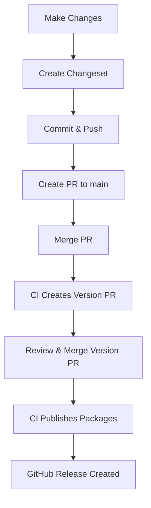

# QOR5 Frontend Infrastructure

[中文文档](./README.zh-CN.md)

A monorepo template for quickly publishing frontend packages to GitHub Packages. Built with pnpm workspaces, Changesets, and automated CI/CD workflows.

## Features

- 🚀 **Quick Setup**: Get started in minutes with pre-configured tooling
- 📦 **Monorepo Support**: Manage multiple packages in a single repository using pnpm workspaces
- 🔄 **Automated Publishing**: Seamless package publishing to GitHub Packages via Changesets
- 🔍 **Code Quality**: Pre-configured ESLint, Prettier, and lint-staged with Husky hooks
- 📝 **Changelog Generation**: Automatic changelog generation from conventional commits
- 🏷️ **Version Management**: Semantic versioning with Changesets
- 🤖 **CI/CD**: GitHub Actions workflows for automated testing and publishing

## Quick Start

### Prerequisites

- Node.js 22+
- pnpm 10.17.1+
- GitHub account with package publishing permissions

### Installation

```bash
# Clone the repository
git clone https://github.com/theplant/qor5-fe-infra.git
cd qor5-fe-infra

# Install dependencies
pnpm install

# Or use the bootstrap script
pnpm bootstrap
```

### Create Your First Package

```bash
# Create a new package directory
mkdir -p packages/my-package

# Create package.json
cat > packages/my-package/package.json << EOF
{
  "name": "@theplant/my-package",
  "version": "0.0.0",
  "publishConfig": {
    "registry": "https://npm.pkg.github.com"
  }
}
EOF
```

## Project Structure

```
qor5-fe-infra/
├── .changeset/           # Changeset configuration and pending changesets
├── .github/
│   └── workflows/
│       └── release.yml   # Automated release workflow
├── .husky/              # Git hooks
├── packages/            # Your packages
│   ├── fe-lint-kit/    # ESLint configurations
│   └── fetch-middleware/ # HTTP middleware utilities
├── apps/                # Optional: apps using your packages
├── package.json         # Root package configuration
├── pnpm-workspace.yaml  # pnpm workspace configuration
├── .npmrc              # npm registry configuration
└── README.md
```

## Development Workflow

### 1. Make Changes

Edit your packages in the `packages/` directory. All packages are managed in this monorepo.

### 2. Create a Changeset

When you've made changes that should be published, create a changeset:

```bash
# Run from repository root
pnpm changeset
```

This will:

- Prompt you to select which packages changed
- Ask for the semver bump type (major/minor/patch)
- Request a summary of the changes
- Generate a `.changeset/*.md` file

### 3. Commit and Push

```bash
git add .
git commit -m "feat: add new feature"
git push origin your-branch
```

### 4. Create Pull Request

Open a PR to the `main` branch. Once merged, the CI will automatically:

- Create a "Version Packages" PR with updated versions and changelogs

### 5. Publish

Merge the "Version Packages" PR, and the CI will:

- Bump package versions
- Update changelogs
- Publish changed packages to GitHub Packages
- Create a GitHub Release with links to changelogs

## Publishing Flow

### Automated Flow (Recommended)



### Manual Publishing

For emergency releases or local testing:

```bash
# Update versions locally
pnpm changeset version
pnpm install --no-frozen-lockfile

# Publish manually
pnpm release
```

## Using Published Packages

### Configure NPM Authentication

Create a `.npmrc` file in your project:

```bash
//npm.pkg.github.com/:_authToken=${GITHUB_TOKEN}
@theplant:registry=https://npm.pkg.github.com
```

### Generate GitHub Token

1. Go to GitHub Settings → Developer settings → Personal access tokens → Tokens (classic)
2. Generate new token with `read:packages` scope
3. Set environment variable:

```bash
export GITHUB_TOKEN=your_token_here
```

### Install Packages

```bash
# Install a specific package
pnpm add @theplant/fe-lint-kit

# Or with npm
npm install @theplant/fe-lint-kit
```

## Repository Configuration

### Required GitHub Settings

Go to **Repository Settings → Actions → General**:

1. **Workflow permissions**: Select "Read and write permissions"
2. **Enable**: "Allow GitHub Actions to create and approve pull requests"

### Package Naming Rules

All packages must:

- Use the `@theplant` scope
- Have `publishConfig.registry` set to `https://npm.pkg.github.com`

Example `package.json`:

```json
{
  "name": "@theplant/your-package",
  "version": "1.0.0",
  "publishConfig": {
    "registry": "https://npm.pkg.github.com"
  }
}
```

## Scripts

| Command                  | Description                          |
| ------------------------ | ------------------------------------ |
| `pnpm bootstrap`         | Install all dependencies             |
| `pnpm changeset`         | Create a new changeset               |
| `pnpm changeset version` | Update versions from changesets      |
| `pnpm release`           | Publish packages and create git tags |
| `pnpm format`            | Format code with Prettier            |
| `pnpm knip`              | Find unused dependencies             |

## Troubleshooting

### No Version PR Created

**Cause**: No changeset files were merged to `main`

**Solution**: Ensure you've created and committed a changeset file before merging your PR

### "Resource not accessible by integration" Error

**Cause**: Insufficient workflow permissions

**Solution**: Check repository settings → Actions → General → Workflow permissions

### Publishing Returns 404/403

**Cause**: Package scope or registry misconfiguration

**Solution**:

- Ensure package name uses `@theplant` scope
- Verify `publishConfig.registry` is set to `https://npm.pkg.github.com`
- Check GitHub token has `write:packages` permission

### Changeset Not Detected

**Cause**: Changeset file not in the correct format

**Solution**: Delete the changeset and create a new one using `pnpm changeset`

## Packages in This Monorepo

### [@theplant/fe-lint-kit](./packages/fe-lint-kit)

ESLint and Prettier configurations for consistent code quality across projects.

### [@theplant/fetch-middleware](./packages/fetch-middleware)

HTTP middleware utilities for handling requests, responses, and Protocol Buffers errors.

## Contributing

1. Fork the repository
2. Create your feature branch (`git checkout -b feature/amazing-feature`)
3. Create a changeset (`pnpm changeset`)
4. Commit your changes (`git commit -m 'feat: add amazing feature'`)
5. Push to the branch (`git push origin feature/amazing-feature`)
6. Open a Pull Request

## Best Practices

### Changeset Messages

Write clear, concise changeset summaries:

```markdown
# Good

- Add retry logic to fetch middleware
- Fix TypeScript types for error handling

# Avoid

- Update stuff
- Fix bug
```

### Versioning Guidelines

- **Major**: Breaking changes (API changes, removed features)
- **Minor**: New features (backward compatible)
- **Patch**: Bug fixes (backward compatible)

### Commit Messages

Follow [Conventional Commits](https://www.conventionalcommits.org/):

- `feat:` New features
- `fix:` Bug fixes
- `docs:` Documentation changes
- `chore:` Maintenance tasks
- `refactor:` Code refactoring
- `test:` Test updates

## License

ISC

## Support

For issues, questions, or contributions, please [open an issue](https://github.com/theplant/qor5-fe-infra/issues) on GitHub.

---
