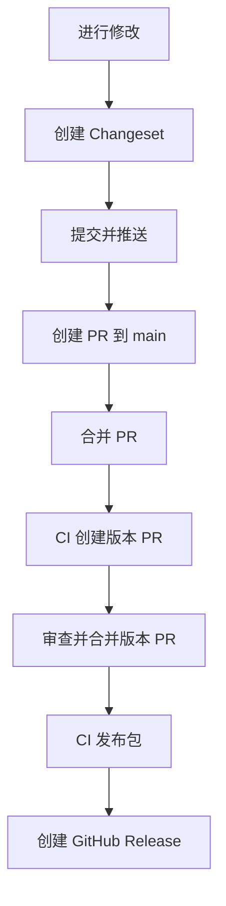

# QOR5 前端基础设施

[English Documentation](./README.md)

一个用于快速发布前端包到 GitHub Packages 的 monorepo 模板。基于 pnpm workspaces、Changesets 和自动化 CI/CD 工作流构建。

## 特性

- 🚀 **快速启动**: 预配置工具链，几分钟内即可开始使用
- 📦 **Monorepo 支持**: 使用 pnpm workspaces 在单一仓库中管理多个包
- 🔄 **自动发布**: 通过 Changesets 无缝发布包到 GitHub Packages
- 🔍 **代码质量**: 预配置 ESLint、Prettier 和 lint-staged，集成 Husky 钩子
- 📝 **变更日志生成**: 从规范化提交自动生成变更日志
- 🏷️ **版本管理**: 使用 Changesets 进行语义化版本控制
- 🤖 **CI/CD**: GitHub Actions 工作流自动化测试和发布

## 快速开始

### 前置要求

- Node.js 22+
- pnpm 10.17.1+
- 拥有包发布权限的 GitHub 账号

### 安装

```bash
# 克隆仓库
git clone https://github.com/theplant/qor5-fe-infra.git
cd qor5-fe-infra

# 安装依赖
pnpm install

# 或使用 bootstrap 脚本
pnpm bootstrap
```

### 创建你的第一个包

```bash
# 创建新的包目录
mkdir -p packages/my-package

# 创建 package.json
cat > packages/my-package/package.json << EOF
{
  "name": "@theplant/my-package",
  "version": "0.0.0",
  "publishConfig": {
    "registry": "https://npm.pkg.github.com"
  }
}
EOF
```

## 项目结构

```
qor5-fe-infra/
├── .changeset/           # Changeset 配置和待处理的变更集
├── .github/
│   └── workflows/
│       └── release.yml   # 自动发布工作流
├── .husky/              # Git 钩子
├── packages/            # 你的包
│   ├── fe-lint-kit/    # ESLint 配置
│   └── fetch-middleware/ # HTTP 中间件工具
├── apps/                # 可选：使用你的包的应用
├── package.json         # 根包配置
├── pnpm-workspace.yaml  # pnpm workspace 配置
├── .npmrc              # npm 注册表配置
└── README.md
```

## 开发工作流

### 1. 进行修改

在 `packages/` 目录中编辑你的包。所有包都在这个 monorepo 中管理。

### 2. 创建 Changeset

当你完成需要发布的修改后，创建一个 changeset：

```bash
# 从仓库根目录运行
pnpm changeset
```

这将会：

- 提示你选择哪些包发生了变化
- 询问语义化版本的升级类型（major/minor/patch）
- 要求输入变更摘要
- 生成 `.changeset/*.md` 文件

### 3. 提交并推送

```bash
git add .
git commit -m "feat: 添加新功能"
git push origin your-branch
```

### 4. 创建 Pull Request

向 `main` 分支提交 PR。合并后，CI 将自动：

- 创建包含更新版本和变更日志的 "Version Packages" PR

### 5. 发布

合并 "Version Packages" PR，CI 将：

- 升级包版本
- 更新变更日志
- 将变更的包发布到 GitHub Packages
- 创建包含变更日志链接的 GitHub Release

## 发布流程

### 自动化流程（推荐）



### 手动发布

用于紧急发布或本地测试：

```bash
# 在本地更新版本
pnpm changeset version
pnpm install --no-frozen-lockfile

# 手动发布
pnpm release
```

## 使用已发布的包

### 配置 NPM 认证

在你的项目中创建 `.npmrc` 文件：

```bash
//npm.pkg.github.com/:_authToken=${GITHUB_TOKEN}
@theplant:registry=https://npm.pkg.github.com
```

### 生成 GitHub Token

1. 前往 GitHub Settings → Developer settings → Personal access tokens → Tokens (classic)
2. 生成具有 `read:packages` 权限的新 token
3. 设置环境变量：

```bash
export GITHUB_TOKEN=your_token_here
```

### 安装包

```bash
# 安装特定包
pnpm add @theplant/fe-lint-kit

# 或使用 npm
npm install @theplant/fe-lint-kit
```

## 仓库配置

### 必需的 GitHub 设置

前往 **Repository Settings → Actions → General**：

1. **Workflow permissions**: 选择 "Read and write permissions"
2. **启用**: "Allow GitHub Actions to create and approve pull requests"

### 包命名规则

所有包必须：

- 使用 `@theplant` 作用域
- 在 `publishConfig.registry` 中设置为 `https://npm.pkg.github.com`

示例 `package.json`：

```json
{
  "name": "@theplant/your-package",
  "version": "1.0.0",
  "publishConfig": {
    "registry": "https://npm.pkg.github.com"
  }
}
```

## 脚本命令

| 命令                     | 说明                     |
| ------------------------ | ------------------------ |
| `pnpm bootstrap`         | 安装所有依赖             |
| `pnpm changeset`         | 创建新的 changeset       |
| `pnpm changeset version` | 从 changesets 更新版本   |
| `pnpm release`           | 发布包并创建 git 标签    |
| `pnpm format`            | 使用 Prettier 格式化代码 |
| `pnpm knip`              | 查找未使用的依赖         |

## 故障排除

### 没有创建版本 PR

**原因**: 没有 changeset 文件被合并到 `main`

**解决方案**: 确保在合并 PR 之前已创建并提交了 changeset 文件

### "Resource not accessible by integration" 错误

**原因**: 工作流权限不足

**解决方案**: 检查仓库设置 → Actions → General → Workflow permissions

### 发布返回 404/403

**原因**: 包作用域或注册表配置错误

**解决方案**:

- 确保包名使用 `@theplant` 作用域
- 验证 `publishConfig.registry` 设置为 `https://npm.pkg.github.com`
- 检查 GitHub token 拥有 `write:packages` 权限

### Changeset 未被检测到

**原因**: Changeset 文件格式不正确

**解决方案**: 删除 changeset 并使用 `pnpm changeset` 创建新的

## Monorepo 中的包

### [@theplant/fe-lint-kit](./packages/fe-lint-kit)

用于跨项目保持一致代码质量的 ESLint 和 Prettier 配置。

### [@theplant/fetch-middleware](./packages/fetch-middleware)

用于处理请求、响应和 Protocol Buffers 错误的 HTTP 中间件工具。

## 贡献

1. Fork 仓库
2. 创建你的特性分支 (`git checkout -b feature/amazing-feature`)
3. 创建 changeset (`pnpm changeset`)
4. 提交你的修改 (`git commit -m 'feat: 添加惊人特性'`)
5. 推送到分支 (`git push origin feature/amazing-feature`)
6. 提交 Pull Request

## 最佳实践

### Changeset 消息

编写清晰、简洁的 changeset 摘要：

```markdown
# 好的示例

- 为 fetch 中间件添加重试逻辑
- 修复错误处理的 TypeScript 类型

# 避免

- 更新内容
- 修复 bug
```

### 版本控制指南

- **Major**: 破坏性变更（API 变更、移除功能）
- **Minor**: 新功能（向后兼容）
- **Patch**: Bug 修复（向后兼容）

### 提交消息

遵循 [Conventional Commits](https://www.conventionalcommits.org/)：

- `feat:` 新功能
- `fix:` Bug 修复
- `docs:` 文档变更
- `chore:` 维护任务
- `refactor:` 代码重构
- `test:` 测试更新

## 许可证

ISC

## 支持

如有问题、疑问或贡献，请在 GitHub 上[提交 issue](https://github.com/theplant/qor5-fe-infra/issues)。
